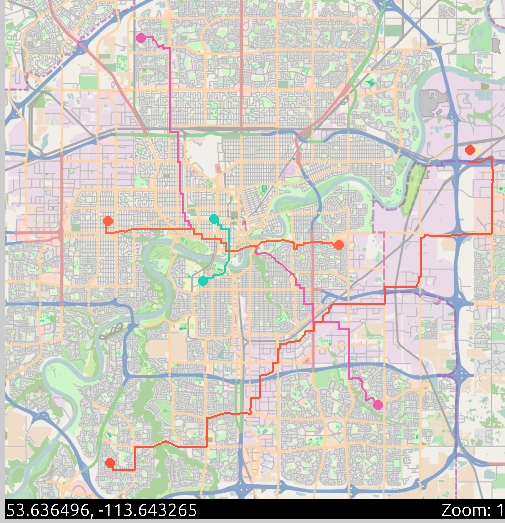

# Assignment Part 2: Navigation System

## Summary

This project implements an interactive navigation system for the Edmonton road network. It consists of a C++ server that computes shortest paths using Dijkstra's algorithm and a Python client that provides a graphical interface for users to select start and end points on a map. The server and client communicate via named pipes. The system displays the computed route on the map and allows for interactive exploration and repeated route queries.

## Screenshot



## Problem Description

- The server reads the Edmonton road network from `edmonton-roads-2.0.1.txt` and builds a weighted directed graph, where vertices represent intersections and edges represent road segments weighted by Manhattan distance.
- The client displays a map of Edmonton and allows the user to select start and end points using mouse clicks.
- When a route is requested, the client sends the coordinates to the server, which finds the closest vertices, computes the shortest path using Dijkstra's algorithm, and returns the sequence of waypoints.
- The client draws the route on the map and allows the user to continue exploring or request new routes.

## Assumptions

- The file `edmonton-roads-2.0.1.txt` is present in the `soln/server` directory.
- The server must be started before the client.
- Named pipes (`inpipe` and `outpipe`) are used for communication and must not already exist before running.
- The user provides valid input via the graphical interface.
- The program is designed for the provided Edmonton map and coordinate system.

## How to Run

1. Build the server:
   ```
   cd Assignments/assignment_part2/soln/server
   make
   ```

2. In the `soln` directory, open two terminals.

3. In the first terminal, start the server:
   ```
   ./server/server
   ```

4. In the second terminal, start the client:
   ```
   python3 client/client.py
   ```

5. Use the graphical interface to select start and end points, zoom, pan, and request routes.

6. To clean up named pipes and object files, run:
   ```
   make clean
   ```

## Example Usage

- Select two points on the map to request a route.
- The route will be displayed as a line connecting the waypoints.
- You can continue to select new points and request additional routes.

## Makefile Targets

- `make` (default): Builds the project.
- `make server`: Links all server object files.
- `make clean`: Removes named pipes, object files, and the server executable.